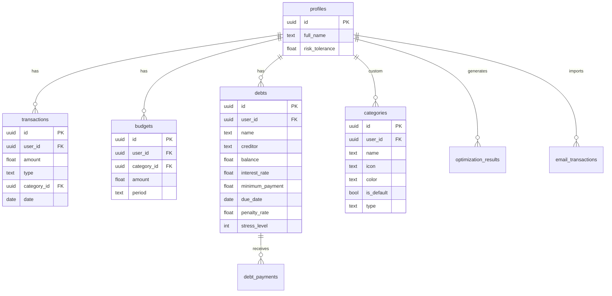

<p align="center">
  <h1 align="center">🗄️ Finara Supabase</h1>
  <p align="center"><strong>Database, Authentication & Backend-as-a-Service for Finara</strong></p>
</p>

---

## 📖 About Finara

**Finara** (_Financial Narrative_) is an explainable, probabilistic financial decision-support system built for students and young professionals. It integrates intelligent expense tracking with risk-aware debt optimization under cashflow uncertainty.

### ✨ Key Features

- **🎯 Explainable Risk Assessment** — AI-powered default probability with SHAP value explanations
- **📄 Smart Document Parsing** — Gemini 2.5 Flash extracts transactions from receipts & statements
- **⚡ Debt Optimization** — AHP-weighted ranking with Monte Carlo cashflow simulation
- **📊 Budget Management** — Category-based budgeting with alerts and analytics
- **💰 Expense Tracking** — Manual and automated transaction tracking with recurring support
- **🎯 Financial Goals** — Track savings goals with progress monitoring
- **🔐 Row Level Security** — Complete data isolation per user

---

## 🏗️ Architecture

This is the **Backend/Database** component of the Finara ecosystem:

```
finara/
├── finara-ml/          # Python/FastAPI — ML Engine
├── finara-supabase/    ← You are here (Supabase/PostgreSQL)
└── finara-web/         # Next.js Frontend
```

Provides the data layer consumed by `finara-web` via Supabase client SDK, and optionally proxies ML requests through Edge Functions.

---

## 📂 Project Structure

```
finara-supabase/
├── supabase/
│   ├── config.toml                                       # Supabase local config
│   ├── seed.sql                                          # Default categories (18 entries)
│   └── migrations/
│       ├── 20260216101734_create_profiles_table.sql
│       ├── 20260216101743_create_categories_table.sql
│       ├── 20260216101754_create_transactions_table.sql
│       ├── 20260216101809_create_budgets_table.sql
│       ├── 20260216101822_create_debts_table.sql
│       ├── 20260216101836_create_debt_payments_table.sql
│       ├── 20260216101847_create_optimization_results_table.sql
│       ├── 20260216101901_create_email_transactions_table.sql
│       ├── 20260216101913_create_gmail_tokens_table.sql
│       ├── 20260216101924_enable_rls_and_policies.sql
│       ├── 20260216101941_create_indexes.sql
│       ├── 20260216101953_create_functions_and_triggers.sql
│       ├── 20260221195647_add_expense_tracker_tables.sql
│       ├── 20260221195659_add_risk_tolerance_to_profiles.sql
│       ├── 20260221195711_create_financial_profile_rpc.sql
│       ├── 20260221203057_process_recurring_transactions.sql
│       ├── 20260222055822_process_debt_payments.sql
│       ├── 20260222055934_insights_rpcs.sql
│       ├── 20260222085340_add_import_history.sql
│       ├── 20260225093400_fix_financial_profile_rpc.sql
│       ├── 20260225094859_fix_debt_payment_triggers.sql
│       ├── 20260225095709_create_debt_overdue_system.sql
│       └── 20260313000000_add_tags_to_transactions.sql
├── personas.md                                           # Test user personas documentation
├── personas_seed.sql                                     # SQL seed for test user data
└── .gitignore
```

---

## 🗃️ Database Schema

The PostgreSQL database contains the following core tables:



### Key Database Features

- **18 default categories** seeded automatically (12 expense, 6 income) with emoji icons and colors
- **Row Level Security (RLS)** policies for complete data isolation per user
- **Recurring transaction engine** via `process_recurring_transactions` RPC
- **Debt payment processing** via `process_debt_payments` RPC
- **Financial profile aggregation** via `create_financial_profile` RPC
- **Insights RPCs** for spending trends and analytics
- **Debt overdue system** with automatic status tracking
- **Import history tracking** for e-statement uploads
- **Comprehensive indexes** on `user_id`, `date`, and `category` columns
- **Triggers** for automatic `updated_at` timestamps

---

## 🛠️ Tech Stack

| Technology | Purpose |
|---|---|
| **Supabase** | Backend-as-a-Service |
| **PostgreSQL 17** | Primary database |
| **Row Level Security (RLS)** | Data isolation per user |
| **Supabase Auth** | User authentication |
| **Edge Functions** | Serverless middleware |
| **Supabase CLI** | Local development & migrations |

---

## 🚀 Getting Started

### Prerequisites

- **Supabase CLI** — [Install guide](https://supabase.com/docs/guides/cli/getting-started)
- **Docker** — Required for local Supabase instance

### Installation

```bash
# Clone the repository
git clone <repository-url>
cd finara-supabase
```

### Start Local Supabase

```bash
# Start all Supabase services (PostgreSQL, Auth, Storage, etc.)
supabase start
```

This will output your local credentials:

```
API URL:   http://127.0.0.1:54321
anon key:  eyJhbGciOi...
service_role key: eyJhbGciOi...
Studio URL: http://127.0.0.1:54323
```

> **Save these values** — you'll need the `API URL` and `anon key` for `finara-web`.

### Apply Migrations & Seed Data

```bash
# Apply all migrations and seed default categories
supabase db reset
```

This will:
1. Apply all 23 migration files in order
2. Seed 18 default categories (12 expense + 6 income)

### Managing Migrations

```bash
# Create a new migration
supabase migration new <migration_name>

# Push migrations to remote Supabase project
supabase db push

# Pull remote schema changes
supabase db pull

# Check migration status
supabase migration list
```

### Supabase Studio

Access the visual database editor at `http://127.0.0.1:54323` after running `supabase start`.

### Stop Supabase

```bash
supabase stop
```

---

## 🔗 Integration with Other Finara Services

### ↔️ Integration with `finara-web`

The frontend connects to Supabase using the `@supabase/ssr` client SDK. Configure the following in `finara-web/.env`:

```env
NEXT_PUBLIC_SUPABASE_URL=http://127.0.0.1:54321   # Local Supabase API URL
NEXT_PUBLIC_SUPABASE_ANON_KEY=your_anon_key        # From 'supabase start' output
```

The web app uses Supabase for:
- **Authentication** — Email/password sign-up and login
- **Data operations** — CRUD for transactions, budgets, debts, goals, and categories
- **RPC calls** — `create_financial_profile`, `process_recurring_transactions`, `process_debt_payments`
- **Real-time** — Optional real-time subscriptions for data updates

### ↔️ Integration with `finara-ml`

The ML engine doesn't directly connect to Supabase. Instead:
1. `finara-web` fetches user data from Supabase
2. `finara-web` sends that data to `finara-ml` for ML processing
3. Results are displayed in the UI or optionally stored back in Supabase

### Deploying to Supabase Cloud

```bash
# Link to your remote Supabase project
supabase link --project-ref <your-project-ref>

# Push migrations
supabase db push

# Update finara-web/.env with your cloud credentials
NEXT_PUBLIC_SUPABASE_URL=https://<your-project-ref>.supabase.co
NEXT_PUBLIC_SUPABASE_ANON_KEY=<your-cloud-anon-key>
```

---

## 🧪 Test Data

The repository includes test data for demo purposes:

- **`personas.md`** — Documentation of test user personas (responsible, irresponsible, normal)
- **`personas_seed.sql`** — SQL insert statements to seed test users with transactions, budgets, goals, and debts

To seed test data:

```bash
# Run in Supabase SQL Editor or via psql
psql <database-url> -f personas_seed.sql
```

---

<p align="center">
  Built with 🗄️ PostgreSQL + 🔐 Row Level Security + ⚡ Edge Functions
</p>
